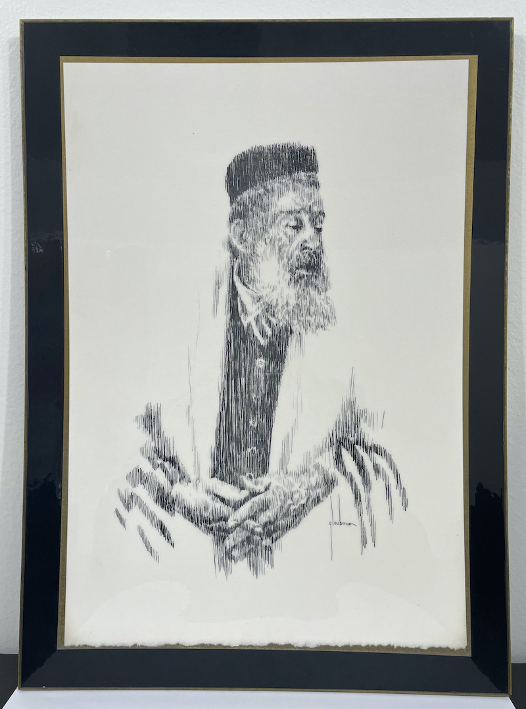

# Glaubman

* Edna (Levine) Glaubman
* H=13", W=9"
* Signed Lithograph
* Similar on ebay: $100

## Edna Glaubman
* 1919-1986
* Born in Manhattan, NY
* Studied at the Art Student’s League in Woodstock, New York
* A graduate then faculty at the Parson School of Fine and Applied Arts in New York.
* Lived in south Florida 
* Mother of Rod Glaubman (1951-2018)
* was an important American artist whose work remains today as a lasting testament to an extraordinary woman. Her work is on the one hand unique, inventive and incomparable and on the other evokes Monet, Chagall, Matisse and Klimt. A serious student of her predecessors, Glaubman experimented in materials ranging from metal and clay sculpture, to resins and polymers. She worked with a variety of papers, inks, acrylics, pencil, charcoal and pastel. Her subjects varied widely and included landscapes, portraits, horses, nudes, social gatherings, and intimate family moments. She pioneered the use of acrylics and used an original technique where she affixed crushed paper to the boards and then employed specialized inks to achieve a final effect that resembles Javanese batik fabrics. Glaubman occupies a section of Miami’s history when the city was first emerging as an important creative metropolitan center and the influences of her creativity are both subtle and apparent. Glaubman periodically produced drawings and lithos for charities that touched her heart. A portrait of dignity for the Jewish Home for The Aged, fundraising pieces for the Hope School and Haven Schools, the Cerebral Palsy Foundation, the Miami/Florida Philharmonic, P.A.C.E. Concerts, the Grove House and for South Miami Oncology (for a nurse training program). Her charities were most often for special needs kids with the obvious connection to her son, Michael. (3)

## References
1. https://www.askart.com/artist/Edna_Glaubman/11160095/Edna_Glaubman.aspx
2. http://www.mbartsandculture.org/event/edna-glaubman-retrospective-exhibition-opening-rod-glaubman-memorial/
3. https://shop.booksandbooks.com/event/coral-gables-gallery-night-edna-glaubman-gables
4. http://www.miamiartguide.com/wdna-jazz-gallery-to-exhibit-works-from-the-edna-glaubman-family-collection/
5. **https://www.ebth.com/items/9962472-edna-glaubman-lithograph**

## Notes from Paul Alan Fine
Mr. Fine sent me these notes about this art:

On 2023.05.20
> The "old man" in the lithograph was my great-grandfather, Jacob Shmei Schneider (1851-1943).
Jacob was the grandfather of Edna's husband, Maurice Glaubman (c. 1914-1975), as well as the grandfather of my mother, Flora Kudlick (1906-1986). (My mother's mother was Rose Schneider, who married Ruben Kudlick).
Flora had two-sided printed brochures (probably from the 1970s) which referred to the lithograph as "The Zeyde" ("The Grandfather," in Yiddish).

On 2023.05.23
> A little more info: my mother told me that to avoid serving in the Russian Army (in the 1870s, I assume) Jacob, a very observant Jew, placed a chemical in one of his eyes, damaging it and allowing him to be rejected for military service.
You can read more about my great-grandfather at https://www.geni.com/people/Jacob-Schneider/6000000059994201996
